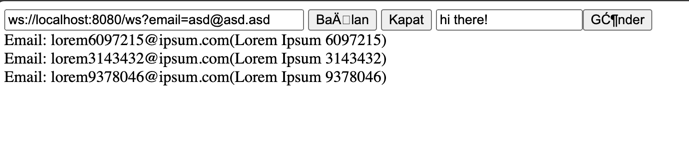

# Spring Kotlin Debezium CDC, Change Data Capture

## Setup
docker-compose.yml dizinine gidilip aşağıdaki container'lar çalıştırılır.
```sh
docker-compose up -d
```

resources/static altındaki postman collection ile debezium ile postgres bağlantısı yapılır. Örnek setup;
```
curl --location 'http://localhost:8083/connectors' \
--header 'Content-Type: application/json' \
--data '{
    "name": "postgreSQL-connector-local",
    "config": {
        "name": "postgreSQL-connector-local",
        "connector.displayName": "PostgreSQLL",
        "connector.class": "io.debezium.connector.postgresql.PostgresConnector",
        "tasks.max": "1",
        "topic.prefix": "postgresql-changes-local",
        "database.hostname": "postgres",
        "database.port": "5432",
        "database.user": "postgres",
        "database.password": "senocak",
        "database.dbname": "boilerplate",
        "database.server.name": "master-db",
        "connector.id": "postgres",
        "plugin.name": "pgoutput"
        
    }
}'
```

### NOT
Eğer tablolardaki "BEFORE" event'ini de yakalamak için ilgili tablolara aşağıdaki sql koşulur.

```postgresql
ALTER TABLE public.users REPLICA IDENTITY FULL;
```
https://stackoverflow.com/questions/59799503/postgres-debezium-does-not-publish-the-previous-state-of-a-record

### Demo

http://localhost:8080/index.html



